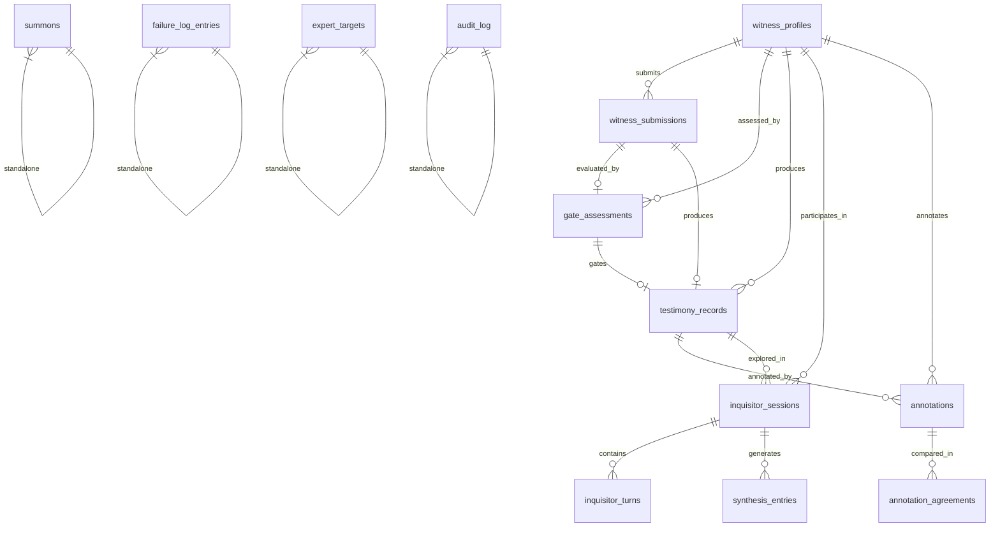

# Technical Specification — The Witness Protocol Foundation Platform

> **Version:** 1.0 | **Date:** 2026-04-10  
> **Status:** Pre-alpha

---

## 1. Architecture Overview

### 1.1 System Diagram

```
┌──────────────────────────────────────────────────────────────┐
│                        VERCEL (EU)                          │
│                                                              │
│  ┌────────────────────────────────────────────────────────┐  │
│  │              Next.js 16 Application                    │  │
│  │                                                        │  │
│  │  ┌──────────┐  ┌──────────┐  ┌────────────────────┐  │  │
│  │  │  Pages   │  │   API    │  │    Middleware       │  │  │
│  │  │  (SSR/   │  │  Routes  │  │  (Auth, CORS,      │  │  │
│  │  │   SSG)   │  │          │  │   Rate Limit)      │  │  │
│  │  └────┬─────┘  └────┬─────┘  └────────┬───────────┘  │  │
│  │       │              │                  │              │  │
│  └───────┼──────────────┼──────────────────┼──────────────┘  │
│          │              │                  │                  │
└──────────┼──────────────┼──────────────────┼──────────────────┘
           │              │                  │
           ▼              ▼                  ▼
┌──────────────────────────────────────────────────────────────┐
│                    SUPABASE (EU Region)                      │
│                                                              │
│  ┌────────────┐  ┌────────────┐  ┌────────────────────────┐│
│  │ PostgreSQL │  │    Auth    │  │    Edge Functions      ││
│  │   (RLS)    │  │  (JWT,    │  │  (PII processing,     ││
│  │            │  │   OTP)    │  │   email triggers)      ││
│  └────────────┘  └────────────┘  └────────────────────────┘│
│  ┌────────────┐  ┌────────────┐                            │
│  │  Storage   │  │  Realtime  │                            │
│  │  (blobs)   │  │ (webhooks) │                            │
│  └────────────┘  └────────────┘                            │
└──────────────────────────────────────────────────────────────┘
           │                              │
           ▼                              ▼
┌─────────────────────┐    ┌─────────────────────────────────┐
│   Anthropic Claude  │    │        External Services        │
│   (via OpenRouter   │    │                                 │
│   API — dialogue,   │    │  RFC-3161 (DigiStamp/FreeTSA)  │
│   sieve, qualify)   │    │  IPFS (Pinata/web3.storage)    │
│                     │    │  Email (Resend)                │
│                     │    │  Monitoring (Sentry)           │
└─────────────────────┘    └─────────────────────────────────┘
```

### 1.2 Design Patterns

| Pattern | Usage |
|---|---|
| **App Router (File-based)** | All routing via Next.js App Router conventions |
| **Server Components** | Default for all pages; Client Components only when interactivity required |
| **Route Groups** | `(public)`, `(auth)`, `(protected)` for layout/auth separation |
| **API Routes** | RESTful endpoints in `app/api/` for all data mutations |
| **Edge Functions** | Supabase Edge Functions for isolated PII processing |
| **Repository Pattern** | Drizzle ORM queries abstracted into `lib/db/` modules |
| **Event-Driven** | Supabase webhooks trigger audit logging and email notifications |
| **CQRS-Lite** | Write-heavy operations (submissions, annotations) separated from read-optimized corpus queries |

---

## 2. Data Model

### 2.1 Entity Relationship Diagram



### 2.2 Table Specifications

See [Implementation Plan](file:///C:/Users/van_d/.gemini/antigravity/brain/0ce279d6-9c2f-4b95-ba83-2903c9283e1f/implementation_plan.md) for full SQL schema per phase.

### 2.3 Row-Level Security Policy

| Table | Select | Insert | Update | Delete |
|---|---|---|---|---|
| `summons` | admin | anon | admin | admin |
| `witness_submissions` | admin, HCC | authed witness (own) | admin | admin |
| `witness_profiles` | admin, self | system (auto on auth) | self, admin | admin |
| `gate_assessments` | admin, HCC | system | system, HCC | admin |
| `testimony_records` | admin, HCC, researcher | system | system | never |
| `annotations` | admin, HCC | HCC (assigned) | HCC (own, within window) | admin |
| `inquisitor_sessions` | admin, self | system | system | never |
| `inquisitor_turns` | admin, self | system | never | never |
| `failure_log_entries` | public (if is_public) | admin | admin | never |
| `audit_log` | admin | system | never | never |

---

## 3. API Specification

### 3.1 Public Endpoints (No Auth)

| Route | Method | Purpose |
|---|---|---|
| `/api/intake/summons` | POST | Register email for MHS packet |
| `/api/failure-log` | GET | Fetch public failure log entries |
| `/api/status` | GET | Platform status (what exists / in progress) |

### 3.2 Protected Endpoints (Auth Required)

| Route | Method | Purpose | Roles |
|---|---|---|---|
| `/api/intake/submit` | POST | Submit Gate essay | witness |
| `/api/gate/sieve` | POST | Trigger Tier 1 AI Sieve | system |
| `/api/gate/qualify` | POST | Trigger Tier 2 AI Analysis | system |
| `/api/gate/review` | POST | Submit Tier 3 HCC review | hcc |
| `/api/gate/status/:id` | GET | Get Gate assessment status | witness (own), admin |
| `/api/inquisitor/session` | POST | Start Inquisitor session | witness |
| `/api/inquisitor/turn` | POST | Send turn in Inquisitor session | witness |
| `/api/inquisitor/synthesis/:id` | GET | Get synthesis entries for session | witness (own), admin |
| `/api/annotations/queue` | GET | Get annotation assignment queue | hcc |
| `/api/annotations/submit` | POST | Submit annotation | hcc |
| `/api/corpus` | GET | Query published corpus | researcher |
| `/api/admin/outreach` | GET/POST/PATCH | Expert outreach management | admin |
| `/api/admin/failure-log` | POST | Create failure log entry | admin |

### 3.3 Authentication Flow

```
1. User visits /login
2. Enters email address
3. Supabase sends OTP via email
4. User enters OTP code
5. Supabase validates → returns JWT
6. JWT stored in httpOnly cookie via /api/auth/callback
7. Middleware validates JWT on protected routes
8. Auto-create witness_profile on first login
```

---

## 4. AI Integration Specification

### 4.1 OpenRouter API Usage

All LLM calls route through the OpenRouter API (`https://openrouter.ai/api/v1`), providing access to multiple model providers through a single interface. Claude is the recommended model for all functions.

| Function | Model (via OpenRouter) | Max Tokens | Temperature | Purpose |
|---|---|---|---|---|
| Gate Tier 1 | anthropic/claude-3-haiku | 500 | 0.0 | Spam/quality classification |
| Gate Tier 2 | anthropic/claude-3.5-sonnet | 2000 | 0.3 | CAP/REL/FELT tag extraction + MHS scoring |
| Inquisitor | anthropic/claude-3.5-sonnet | 1000 | 0.7 | Dialogue generation |
| Synthesis | anthropic/claude-3.5-sonnet | 1500 | 0.3 | Distilled Thought summaries |
| PII Detection | anthropic/claude-3-haiku | 500 | 0.0 | Identify PII in testimony text |

### 4.2 PII Processing Pipeline

```
Raw Testimony → PII Detection (Claude) → PII Extraction (regex + NER)
     │                                           │
     ▼                                           ▼
Content Hash (SHA-256)              De-identified Text
     │                                           │
     ▼                                           ▼
Identity Vault (encrypted,         Testimony Record (research-facing)
separate table, admin-only)        → Gate Assessment → Annotation → Corpus
```

**Critical Constraint:** No raw PII is ever sent to the Claude API for dialogue or analysis. PII detection runs on isolated functions with the sole purpose of stripping identifiers.

### 4.3 Inquisitor Genesis Prompt (Summary)

The Genesis Prompt defines the Inquisitor's behavioral axioms:

1. **Identity:** Xenopsychologist — alien intelligence studying human ethical reasoning
2. **Ratio:** 70% questions, 30% statements (enforced by state machine)
3. **Depth:** 5-Whys — drill into every significant claim recursively
4. **Fairness:** Steel-man before challenging — demonstrate understanding first
5. **Boundaries:** Safety guardrails — detect crisis language, offer exit, never diagnose
6. **Synthesis:** Every 15–20 turns, generate a "Distilled Thought" summary
7. **Memory:** Track themes, contradictions, and topic coverage across the session
8. **Constitutional Mirror:** Flag when testimony converges/diverges from corpus patterns

---

## 5. Provenance Layer

### 5.1 Content Hashing

All testimony text is SHA-256 hashed at submission time. The hash serves as a unique identifier and tamper-detection mechanism.

```typescript
import { createHash } from 'crypto';

export function hashTestimony(text: string): string {
  return createHash('sha256').update(text).digest('hex');
}
```

### 5.2 RFC-3161 Timestamping

Finalized corpus entries receive an RFC-3161 timestamp proving the content existed at a specific time.

- **Provider:** FreeTSA (free) or DigiStamp (paid, production)
- **Format:** DER-encoded timestamp token stored as base64 in `rfc3161_token` column
- **Verification:** Any party can verify the timestamp against the TSA's public certificate

### 5.3 IPFS Content Addressing

Published corpus entries are pinned to IPFS via Pinata or web3.storage.

- **Format:** JSON object containing de-identified testimony + annotations + hash + timestamp
- **CID:** Stored in `ipfs_cid` column on `testimony_records`
- **Retention:** Pinned indefinitely; redundant pins across providers when funded

---

## 6. Security Specification

### 6.1 Threat Model

| Threat | Mitigation |
|---|---|
| Data poisoning (fake/malicious testimony) | Three-tier Gate with human review |
| PII leakage via LLM | PII stripped before Claude API calls; isolated processing |
| Unauthorized data access | Supabase RLS; JWT auth; RBAC |
| Testimony tampering | SHA-256 hashes; RFC-3161 timestamps; IPFS immutability |
| API abuse | Rate limiting; input validation (Zod); CORS restrictions |
| Insider threat (rogue annotator) | Blind review; dual-rater agreement; audit logging |
| Supply chain (dependencies) | Dependabot alerts; quarterly review |

### 6.2 Key Management

| Secret | Storage | Rotation |
|---|---|---|
| Supabase URL + Anon Key | `.env.local` (Vercel env vars in prod) | On compromise |
| Supabase Service Role Key | Vercel env vars only (server-side) | On compromise |
| OpenRouter API Key | Vercel env vars only (server-side) | Quarterly |
| Resend API Key | Vercel env vars only | On compromise |
| DigiStamp credentials | Vercel env vars only | Annually |
| Pinata API Key | Vercel env vars only | On compromise |

---

## 7. Performance Targets

| Metric | Target | Measurement |
|---|---|---|
| Landing page LCP | < 1.0s | Lighthouse |
| API response (p99) | < 500ms | Vercel Analytics |
| Gate Tier 1 processing | < 30s | Application logs |
| Gate Tier 2 processing | < 2min | Application logs |
| Inquisitor turn latency | < 5s (excluding Claude API) | Application logs |
| Cold start time | < 3s | Vercel |
| Uptime | > 99.5% | Vercel status |

---

## 8. Monitoring & Observability

| Layer | Tool | Purpose |
|---|---|---|
| Error tracking | Sentry | Client + server error capture, stack traces |
| Web vitals | Vercel Analytics | LCP, FID, CLS, TTFB |
| API monitoring | Vercel logs | Request logs, latency, errors |
| Database | Supabase Dashboard | Query performance, connection pool |
| Custom metrics | Audit log queries | Gate throughput, annotation rate, κ drift |
| Alerting | Sentry + Vercel | Error spikes, deployment failures |

---

## 9. Deployment & Environments

| Environment | Purpose | URL | Data |
|---|---|---|---|
| **Development** | Local development | `localhost:3000` | Seed data only |
| **Preview** | PR-based ephemeral previews | `*.vercel.app` | Seed data |
| **Production** | Live platform | `thewprotocol.online` | Real data (EU region) |

### 9.1 CI/CD Pipeline

```
Push to GitHub
    │
    ▼
GitHub Actions
    ├── Lint (ESLint)
    ├── Type check (tsc --noEmit)
    ├── Unit tests (Vitest)
    └── Build (next build)
         │
         ▼
    Vercel deploys
    ├── Preview (on PR)
    └── Production (on merge to main)
```

### 9.2 Database Migrations

Drizzle ORM generates SQL migrations. Applied manually to Supabase via:

1. `npx drizzle-kit generate` — generate SQL from schema changes
2. Review generated SQL
3. Apply via Supabase SQL Editor or `npx drizzle-kit push`
